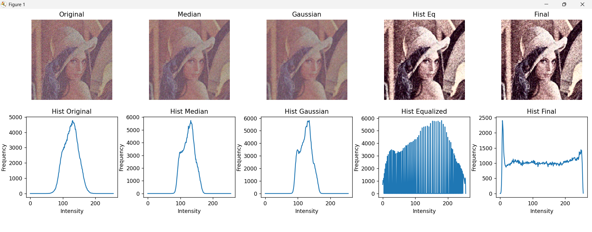
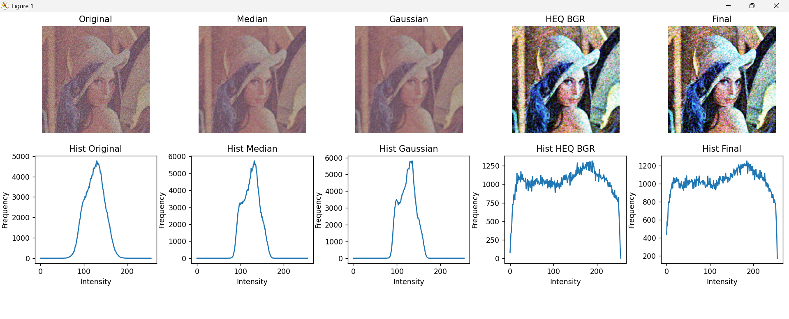

# Mini Project 1 — Image Restoration

**Mata Kuliah:** Pengolahan Citra dan Video  
**Nama:** Athaya Khairani Adi  
**NRP:** 5024241007  

---
##  1. Detail Masalah

| Jenis Degradasi | Penjelasan | Dampak pada Citra |
|----------------|----------|------------------|
| Low Contrast | Rentang intensitas piksel sempit (tidak menyebar dari 0–255), sehingga sebagian besar piksel berada di area tengah (mid-tone) | Gambar terlihat pucat, tidak tajam, dan detail sulit dibedakan |
| Gaussian Noise | Noise acak yang mengikuti distribusi normal dan tersebar di seluruh citra | Muncul butiran halus (grain), membuat citra tampak kasar dan mengganggu detail kecil |
| Salt-and-Pepper Noise | Piksel acak bernilai ekstrem, yaitu 0 (hitam) dan 255 (putih) | Terlihat sebagai titik-titik kontras tinggi yang mengganggu visual secara signifikan |
| Blur | Terjadi akibat proses konvolusi yang meratakan nilai piksel antar tetangga, blur mengurangi komponen frekuensi tinggi (high-frequency) yang berisi informasi detail dan tepi objek | Tepi objek menjadi kabur, detail halus hilang, dan citra terlihat tidak tajam |

---

###  Tujuan Restorasi

Berdasarkan permasalahan di atas, tujuan utama restorasi citra adalah:

- Mengurangi atau menghilangkan berbagai jenis noise (salt-and-pepper dan Gaussian)
- Memperbaiki kontras agar distribusi intensitas lebih merata
- Mengembalikan detail yang hilang akibat blur
- Menghasilkan citra yang lebih jelas, tajam, dan mendekati kondisi ideal

---

##  2. Pipeline Restorasi

| Tahap | Teknik | Apa yang Dilakukan | Alasan Dipilih | Dampak |
|------|--------|------------------|---------------|--------|
| 1 | Median Filter | Mengganti nilai piksel dengan median dari tetangganya dalam kernel | Efektif menghilangkan salt-and-pepper noise tanpa merusak edge | Noise impuls hilang, struktur objek tetap |
| 2 | Gaussian Filter | Melakukan smoothing menggunakan kernel Gaussian berbobot | Mengurangi Gaussian noise (noise halus) | Citra lebih halus, noise berkurang |
| 3A | HEQ (YCbCr) | Equalization hanya pada channel Y (luminance) | Memperbaiki kontras tanpa mengubah warna | Kontras naik, warna tetap natural |
| 3B | HEQ (BGR) | Equalization pada tiap channel warna secara terpisah | Meningkatkan kontras lebih agresif | Kontras tinggi, namun warna bisa berubah |
| 4 | Unsharp Masking | Meningkatkan komponen frekuensi tinggi (detail dan edge) | Mengembalikan detail yang hilang akibat blur | Edge dan detail menjadi lebih tajam |

---

###  Urutan Pipeline
Input → Median → Gaussian → Histogram Equalization → Sharpening → Output

## 3. Perbandingan Visual

## 3.1 Sebelum dan Sesudah Restorasi

Berikut perbandingan antara citra awal yang rusak dengan hasil restorasi menggunakan dua metode histogram equalization.
| Citra Noisy (Input) | Restored (HEQ BGR) | Restored (HEQ YCbCr) |
|--------------------|-------------------|----------------------|
|  |  |  |

## 3.2 Perbandingan Tahap Pipeline
## 3.2.1 Pipeline dengan HEQ YCbCr

# Analisis Gambar

- **Original**: Citra mengandung noise (Gaussian & salt-pepper), blur, dan kontras rendah sehingga detail kurang jelas.  
- **Median Filter**: Noise salt-and-pepper berkurang tanpa merusak bentuk objek.  
- **Gaussian Filter**: Noise halus berkurang, citra lebih bersih, namun sedikit blur.  
- **Histogram Equalization (YCbCr)**: Kontras meningkat signifikan, detail lebih terlihat, warna tetap natural.  
- **Sharpening**: Tepi dan tekstur menjadi lebih tajam, menghasilkan citra yang jelas dan seimbang.  

Pipeline ini menghasilkan citra yang bersih, tajam, dan tetap natural.

---

# Analisis Histogram

- **Original**: Histogram sempit dan terpusat di tengah → kontras rendah.  
- **Median Filter**: Spike ekstrem berkurang → noise impuls berhasil dihilangkan.  
- **Gaussian Filter**: Histogram lebih halus → noise frekuensi tinggi berkurang.  
- **Histogram Equalization (YCbCr)**: Histogram melebar merata ke 0–255 → kontras global meningkat secara seimbang.  
- **Sharpening**: Peningkatan pada area gelap dan terang → kontras lokal meningkat tanpa distribusi menjadi ekstrem.  

Distribusi intensitas menjadi lebih merata dan stabil.

---

## 3.2.2 Pipeline dengan HEQ BGR

# Analisis Gambar

- **Original**: Citra noisy, blur, dan kontras rendah sehingga detail sulit dikenali.  
- **Median Filter**: Noise impuls berkurang, struktur tetap terjaga.  
- **Gaussian Filter**: Noise halus berkurang, citra lebih smooth namun sedikit blur.  
- **Histogram Equalization (BGR)**: Kontras meningkat lebih kuat, detail lebih menonjol, tetapi warna mulai berubah.  
- **Sharpening**: Citra sangat tajam dan kontras tinggi, namun terlihat kurang natural.  

Pipeline ini menghasilkan citra yang tajam dan kontras tinggi, tetapi warna kurang stabil.

---

# Analisis Histogram

- **Original**: Histogram sempit → intensitas terkonsentrasi di mid-range.  
- **Median Filter**: Spike ekstrem berkurang → noise salt-pepper hilang.  
- **Gaussian Filter**: Histogram lebih smooth → noise halus berkurang.  
- **Histogram Equalization (BGR)**: Histogram tiap channel melebar sendiri → distribusi tidak seimbang antar channel.  
- **Sharpening**: Spike kuat di 0 dan 255 → kontras meningkat secara agresif.  

Distribusi intensitas menjadi lebih ekstrem dibanding YCbCr.

---

##  Kesimpulan Perbandingan
Dari kedua pipeline tersebut, dapat disimpulkan bahwa:
- Pipeline **YCbCr** menghasilkan citra yang lebih natural dan seimbang, karena hanya memperbaiki luminance tanpa mengganggu warna. Distribusi histogram lebih stabil, hasil natural  
- Pipeline **BGR** menghasilkan citra yang lebih kontras dan tajam, tetapi berisiko menimbulkan distorsi warna dan peningkatan yang berlebihan pada kontras dan detail. Distribusi lebih agresif, kontras tinggi tetapi kurang natural  

